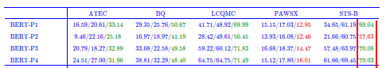

## SimCSE Inplemention

SimCSE在中文上无监督 + 有监督 pytorch版
> SimCSE：https://arxiv.org/pdf/2104.08821.pdf   
> ESimCSE: https://arxiv.org/pdf/2109.04380.pdf

1.database: SNS-B (uploaded)
> directory: data/SNS-B/

2.how to run?
> SimCSE： python train.py  
> ESimCSE： python ESimCSE_train.py

3.Result (un-supervised)  
**spearman corrcoef** is shown as result below:

| Model     | un_supervised |
|-----------|---------------|
| Bert_base | 0.538         |   
| SimCSE    | 0.692         |
| ESimCSE   | 0.707         | 

说明：原论文的无监督SimCSE基于英文，从维基百科上挑了100万个句子进行训练的。本项目评测实验是在中文数据集STS-B(已上传)，实现结果以[苏剑林科学空间结果](https://spaces.ac.cn/archives/8348) 对照。
SimCSE结果与其一致。   
以上供参考， 码代码不易，有用请点赞。  
  
